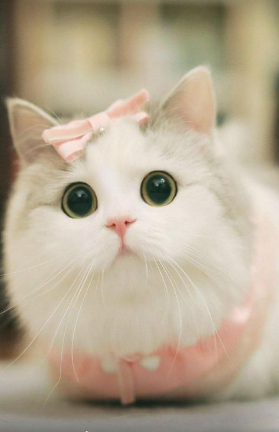

# Samantha  Phan User's Page

My name is Samantha Phan. I am a Computer Science Major at UCSD. 

## Programming 
  
  I have been coding for about *2 years* now and I love learning new things. 

  **Programming Languages:**
  - Java
  - C++
  - Python 
    - (beginning level as I'm currently teaching my younger brother, hard stuff tho for 9 years old ~should've started from making Scratch games~ )
  
Although I know Python at a beginning level in order to teach small kids as one of my goals in life is to become a teacher.

# Code Snippet 

can't forget to leave a hello, world!
``` 
public static void main(String[] args)
{
    System.out.println("Hello, World!");
}
```


# Link to GitHub
Here is an external link to my github profile: [sphan07](https://github.com/sphan07)

Here's a link to the ReadMe.md from this Lab 1 from CSE 110: 
[Link to Lab 1 Readme](README.md)

## About Me 

# Personal Moto
>"Remember that sometimes not getting what you want is a 
> wonderful stroke of luck." - Dalai Lama 

I believe that whatever its meant to be is meant to be. Therefore, all choices we make will lead us on the path we are meant to be on.

# Hobbies
Here is a list of hobbies that I like to do from most liked to least liked:
    1. Watching Abbott Elementary
    2. Reading Comics/Books
    3. Collecting cute pokemon cards
    4. Learning about coding during my free time [here's a section link to the programming portion](#programming)
    5. Gaming (really bad at it tho)
   
   For number 5: here is a list on tech I am trying to learn now and over the summer: 
   - [x] web development
   - [ ] andriod development
   - [ ] cybersecruity 

# Favorite Animal

